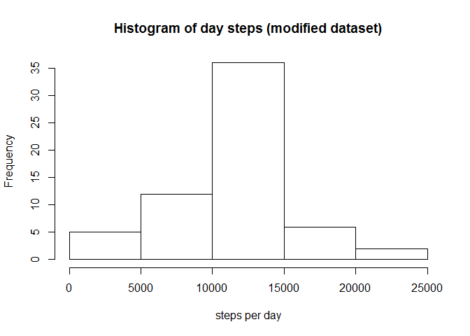
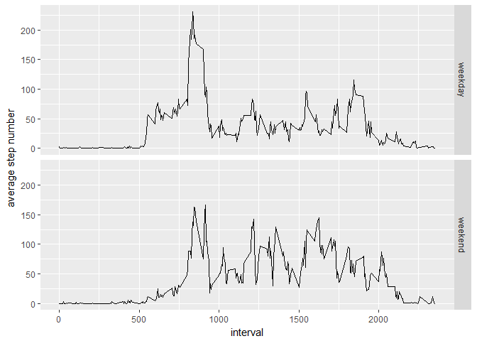

# Reproducible Research: Peer Assessment 1


```r
library(dplyr)
library(ggplot2)
```


## Loading and preprocessing the data

```r
##download.file("https://d396qusza40orc.cloudfront.net/repdata%2Fdata%2Factivity.zip","activity.zip")
##unzip("activity.zip",overwrite = TRUE)
activityData <- read.csv("activity.csv")
```


## What is mean total number of steps taken per day?

```r
daysteps <- activityData %>% filter(!is.na(steps)) %>% group_by(date) %>% summarise_each(funs(sum),steps)
daysteps_mean <- mean(daysteps$steps)
daysteps_median <- median(daysteps$steps)
```

####Histogram of day steps

```r
hist(daysteps$steps,main="Histogram of day steps",xlab = "steps per day")
```

<!-- -->

The mean of steps taken per day is 10766.19; the median is 10765


## What is the average daily activity pattern?


```r
avgstepint <- activityData %>% filter(!is.na(steps)) %>% group_by(interval) %>% summarise_each(funs(mean),steps)
maxstepint <- avgstepint[which.max(avgstepint$steps),1]
maxstepinth <- gsub("([0-9]{1,2})([0-9]{2})", "\\1:\\2",maxstepint)
```

####Time series of 5-mins interval (average number of step taken)

```r
plot(steps ~ interval, avgstepint, type = "l")
```

<!-- -->

  
  The 5-minute interval having maximum number of steps is 835, corresponding to time 8:35


## Imputing missing values


```r
NAcount <- length(activityData[is.na(activityData$steps),1])
```

The number of missing values in the dataset is 2304


```r
activityData2 <- activityData
activityData2$steps <- ifelse(is.na(activityData2$steps),avgstepint$steps[avgstepint$interval %in% activityData2$interval],activityData2$steps)
daysteps2 <- activityData2 %>% group_by(date) %>% summarise_each(funs(sum),steps)
daysteps2_mean <- mean(daysteps2$steps)
daysteps2_median <- median(daysteps2$steps)
```
####Strategy to fill missing values:
The modified dataset has:

* The original step value for date and interval if available
* The interval step mean when data are not available 

####Histogram of day steps (dataset with imputed data)

```r
hist(daysteps2$steps,main="Histogram of day steps (modified dataset)",xlab = "steps per day")
```

<!-- -->

The modified dataset mean of steps taken per day is 10766.19; the median is 10766.19


## Are there differences in activity patterns between weekdays and weekends?

```r
activityData2$dateSpec <-  ifelse(as.POSIXlt(activityData2$date)$wday %in% c(0,6), 'weekend', 'weekday')
avgstepintspec <- activityData2 %>% group_by(interval,dateSpec) %>% summarise_each(funs(mean),steps)
```

####Graphic of weekday activity compared to weekend activity (dataset with imputed data)

```r
ggplot(avgstepintspec,aes(interval,steps))+geom_line()+facet_grid(dateSpec ~ .)+xlab("interval")+ylab("average step number")
```

<!-- -->


